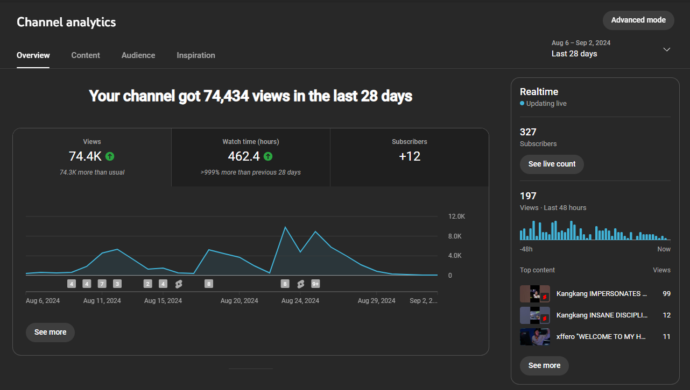

# VCTClipper

  

**VCTClipper** is an automated clipping server designed to capture and provide highlights for short-form content in ongoing Valorant Champions Tour livestreams.

## 🚀 Motivation

I created `VCTClipper` as a fun side project because I became deeply invested in the Valorant Champions Tour. I wanted a tool that would help capture and highlight exciting moments from the streams and ultimately share them online to engage with the community.

## 🌟 Features

- **Automated Highlight Clipping**: Automatically captures and clips highlights based on specific criteria.
- **File System Integrated Funnel**: Efficiently organizes and manages clipped files.
- **Multiple Worker Nodes (Paused)**: Supports handling multiple livestreams simultaneously.
- **YouTube Compatibility**: Works seamlessly with YouTube livestreams.

## 🔮 Future Projections

- **E-Sports Extension**: Enable parameter tuning for different types of e-sports events.
- **Cloud Computing**: Utilize AWS for scalable server computing.
- **Automatic Editing**: Exploring options for automatic editing of clips.
- **Spread Posting**: Allow users to log in to multiple social media platforms and post the same content at once (e.g., YouTube Shorts, TikTok Stories, Instagram Reels, Twitter Posts).

## 📂 Proof of Work

70% of the clips are automated, with the rest recorded manually. The growth is purely from `YouTube Recommendations` , not accumulated from previous content.

- **Published Shorts**: [Check out the clips here](https://www.youtube.com/@darrenmaverick/shorts)

  

## ❓ Why I Discontinued the Project

1. **Seasonal Nature of E-Sports Livestreams**: E-sports livestreams are highly seasonal, impacting sustainable growth. According to `YouTube Shorts Monetization` terms, accumulating 10M views in the past 90 days is required for monetization, which is challenging to achieve.

2. **Popularity of Valorant E-Sports**: Analysis showed that clips average about 5k-30k views even on popular channels. This level of engagement is not sufficient given the seasonal content.

3. **Time Constraints**: The project would have benefited from further refinement and scaling if more time had been available.
